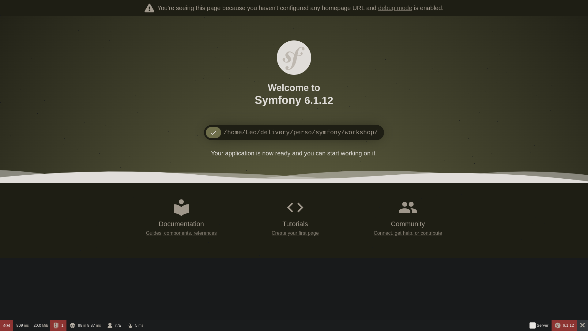
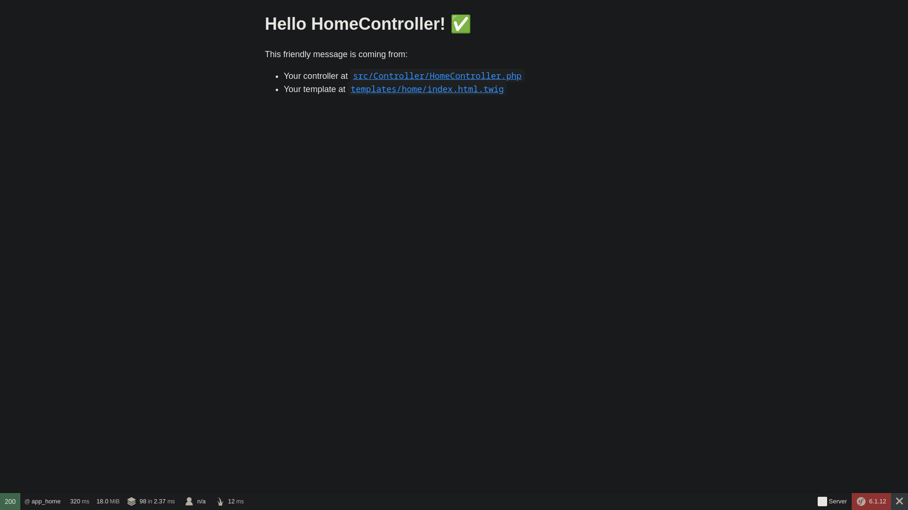
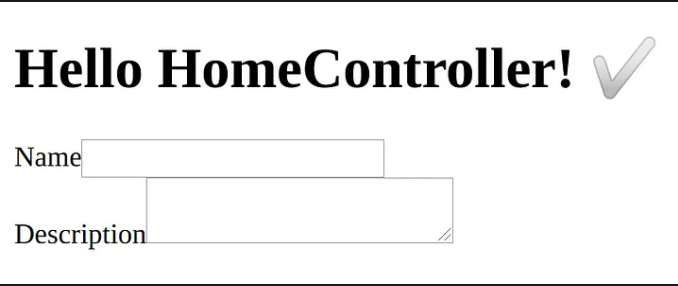
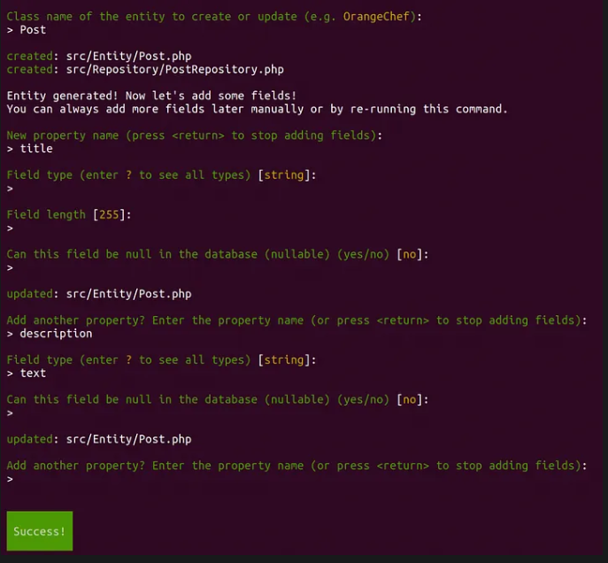

# Workshop-Introduction-Symfony
<div align="right"><i>By Viltard Léo - Epitech Nice - 2023</i></div></br></br></br>
<div align="center">
<h1>Workshop Cython</br>Introduction Framework Symfony</h1>
<a></a>
</div>

</br></br>

## Introduction

If you want to be present you need send an email to leo.viltard@epitech.eu with the following object:
```
[WSSymfony] Nom Prénom
```
__/!\ Put your real firstname and lastname__

In the mail share a `.zip` or `.tar.gz` file with the contents of your repository.\

Any work you do needs to be in the email, if you don't do this or didn't advance into the workshop at all you will be marked absent.

</br></br>

## Installation

Symfony is a PHP Framework using to create website and web application. Built on top og the Symfony Components.

To start, we will install basic components to create our first web page.

- [PHP](https://kinsta.com/fr/blog/installer-php/​)
- [Symfony](https://symfony.com/download/)
- [Composer](https://getcomposer.org/doc/00-intro.md)
  - Composer is the main component of Symfony. It is usefully to set up the base of our project
- [Apache]()
  - Ubuntu: 
  ```angular2html
    sudo apt install apache2
  ```
  - Fedora:
  ```angular2html
    sudo dnf install httpd-manual
  ```

</br></br>

## Exercise 01: Create the skeleton

In this first part you will create your first Symfony skeleton website.

At least of exercise you need to have this following page:

<div align="center"></div>

To perform it, you have to use composer commands.

</br></br>

## Exercise 02: Set up the controller

At least of this part you need to have functional controller and access to your homepage at the "/" path like follow:
<div align="center"></div>

To perform it, you have to learn how work the Symfony console.

</br></br>

## Exercise 03: Discover of TWIG & set up a form

As your controller suggests, we can find your template at:
```angular2html
templates/home/index.html.twig
```

Symfony use Twig as default templating engine.

__Create a form under Symfony is easy.__

Symfony abstracted the basic process and render your form fields dynamically from within PHP.

In this part you will create a function in the home controller to make your first builder instance.

When you FormBuilder instance perform, you can pass it to the template to create a view and rendering your form in Twig.

At least you should have the following page:
<div align="center"></div>

</br></br>

## To go further: Doctrine entity

Now you have functional form.

Let's create our first Doctrine entity.

Doctrine is an abstraction of the link between your PHP code and your database tables

To perform it, you have to pass through the Symfony console
```angular2html
  bin/console make:entity
```

You'll be asked a few questions:
<div align="center"></div>


Have a look in your files:
```angular2html
  src/Entity
```
There should new be Post entity file. Inside that file, you'll find all the fields you entered during the setup commented with ORM annotations.

Now we will use our new entity within our template:

Let me show you an example:
```php
  use App/Entity/Post;
  ...
    $this->render('home/index.html',[
     'posts' => $this->getDoctrine()->getRepository(Post::class)
     ->findAll()
    ];
```
```angular2html

  <h1>{{ post.title }}</h1>
  <p>{{ post.description }}</p>

```

__Is now up to you to know what to do with those code and how it works !__
